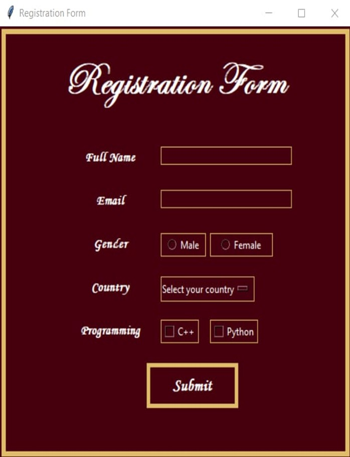
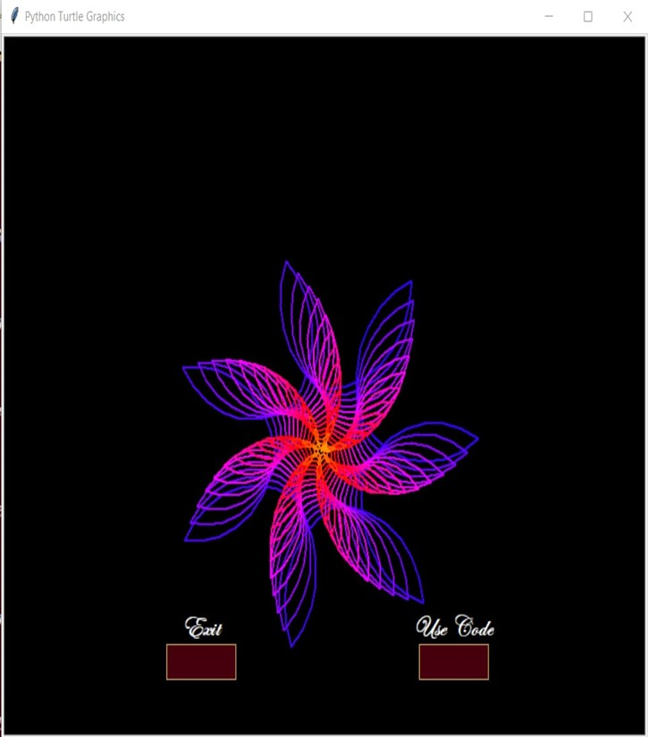

🌸Animation Gallery (Python Tkinter Project)

✨Project Overview
Animation Gallery is a Python-based Tkinter application that displays animated flower patterns, a welcome interface, a registration form, and a main gallery.
The project focuses on clean UI design, smooth navigation, and attractive color themes.

⭐Features
1. Welcome Page
-Elegant interface with custom fonts
-“Login” and “Exit” buttons
-Styled border layout

Screenshot:

2. Registration Form
-Full Name and Email fields
-Gender selection
-Country dropdown
-Programming skills selection
-Validation for empty fields

Screenshot:

3. Main Gallery Page
-Circular image buttons
-Search bar to filter items
-Attractive flower and tree thumbnails
-Smooth and consistent UI theme

Screenshot:

4. Turtle Animations

Includes multiple flower animations such as:

Double Blooms
Bluehead Gilla
Floral Flower
Sunflower
Spiral Patterns

Each animation opens in a Turtle window and also provides a Tkinter explanation page.

Example Screenshot:

🛠Technology Stack
-Python
-Tkinter – GUI development
-Pillow (PIL) – Circular image processing
-Turtle & Colorsys – Animation creation

✨ Highlights
-Smooth UI transitions
-Circular image cropping using PIL
-Elegant fonts (Edwardian Script ITC, Monotype Corsiva)
-Multiple animations generated using Turtle
-Search-based filtering for gallery items
-Inspired design with gold–maroon color theme

📌 Purpose of the Project
The purpose of the Animation Gallery project is to create an interactive and visually appealing graphical user interface using Python and Tkinter.
This project demonstrates how animations, user inputs, images, and GUI components can be combined to develop a functional desktop application.
As an academic project, it aims to enhance practical understanding of GUI development, animation logic, event handling, and user-interface design.
It also helps students learn how to integrate multiple Python libraries to create a complete and user-friendly system.
