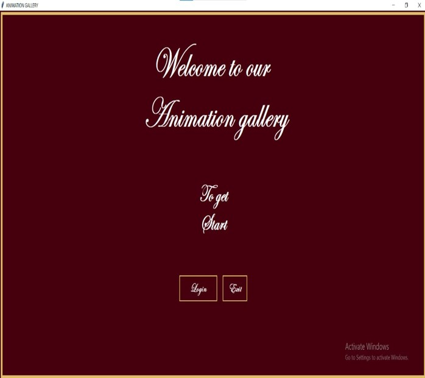
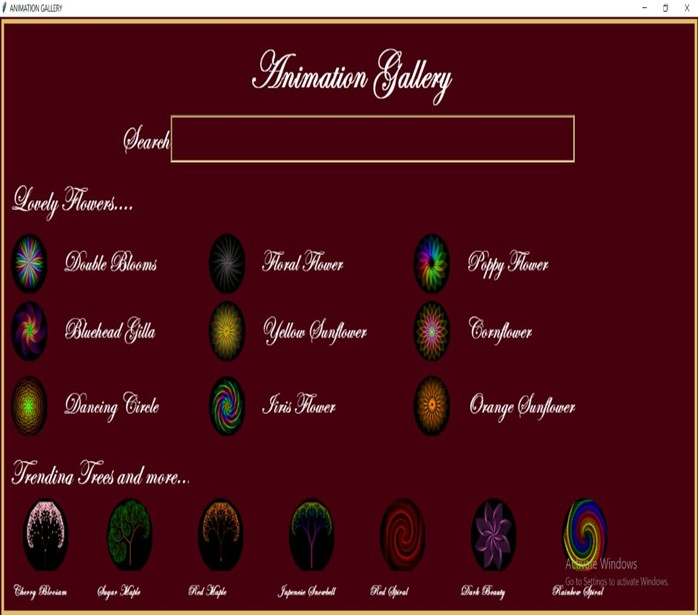

🌸Animation Gallery (Python Tkinter Project)

✨Project Overview
Animation Gallery is a Python-based Tkinter application that displays animated flower patterns, a welcome interface, a registration form, and a main gallery.
The project focuses on clean UI design, smooth navigation, and attractive color themes.

Features
1. Welcome Page
-Elegant interface with custom fonts
-“Login” and “Exit” buttons
-Styled border layout

Screenshot:

2. Registration Form
-Full Name and Email fields
-Gender selection
-Country dropdown
-Programming skills selection
-Validation for empty fields

Screenshot:

3. Main Gallery Page
Circular image buttons
Search bar to filter items
Attractive flower and tree thumbnails
Smooth and consistent UI theme

Screenshot:

